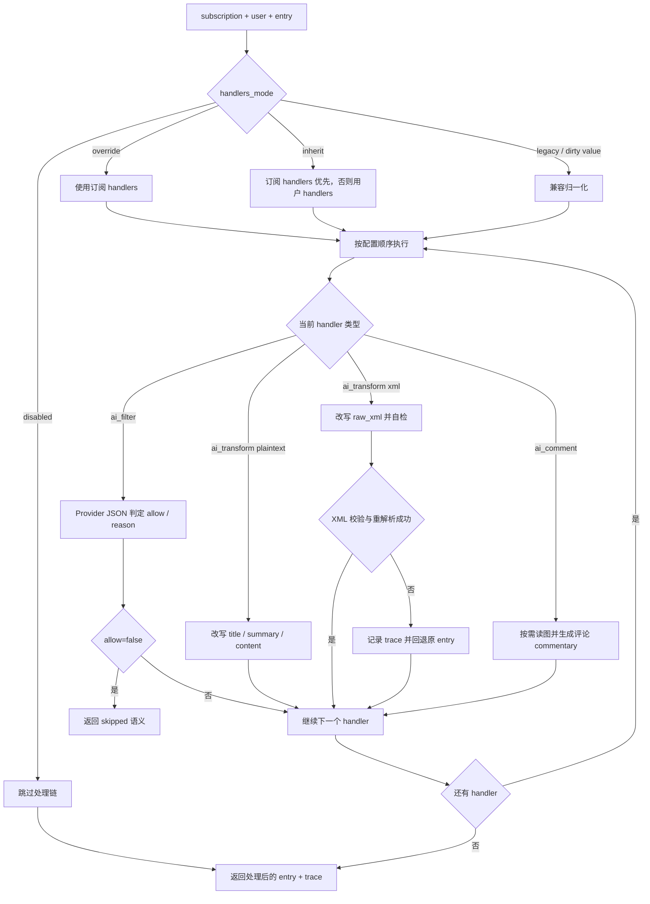

# Handler 运行时

## 负责什么

`ContentHandlerRuntime` 是订阅内容处理链的统一执行器。

它当前负责：

- 决定当前订阅到底启用哪组 handlers
- 按顺序执行 builtin handlers
- 收集 trace
- 处理 AI 失败放行

## 为什么单独做 runtime

handler 的本质是“可配置、可排序、可审计的内容处理步骤”。如果把它们散落在 polling、formatter、sender 里，会出现：

- 顺序不可见
- 配置无法挂在订阅/用户上
- AI 失败语义不统一
- 无法记录 trace

所以 runtime 层的价值，是把“处理链”本身变成一等对象。

## 执行流程图

Handler runtime 的关键不是“有哪些 handler”，而是配置如何解析、执行如何串联、失败如何回到主链路。

## handler 解析算法

核心输入：

- subscription
- user
- entry

解析顺序：

1. `handlers_mode=disabled` -> 不执行
2. `handlers_mode=override` -> 只使用订阅 handlers（可为空）
3. `handlers_mode=inherit`（默认）-> 订阅自带 handlers 优先，未配置时回落到用户 handlers。这样每个群/订阅配了自己的过滤与改写条件后立即生效，无需额外切 override。
4. 其他旧值/空值 -> 按 inherit 兼容处理

这里的目标不是做最严格的 schema 拒绝，而是在 runtime 里尽量容忍历史数据。

另外，`normalize_handlers` 在 handler 缺 `id` 时会用 `name` 自动生成 id（如 `builtin.ai_filter`），避免粘贴 JSON 时被静默丢弃；前端 `normalizeHandlers` 与之保持一致。

## 执行顺序

handlers 按配置顺序串行执行，上一个结果作为下一个输入。

这很重要，因为：

- 基础清洗已经先在 parser / formatter 链完成
- `ai_filter` 要基于当前条目内容决定是否放行
- `ai_transform` 要拿到前面已经处理过的结果

顺序不是按类型固定写死，而是按配置顺序执行。

## builtin handlers 当前语义

### `ai_filter`

- 输入范围支持：
  - `text`
  - `raw_xml`
  - `both`
- 输出：`allow` + `reason`
- 当 `allow=false` 时，dispatcher 写 `skipped` history，不发送
- 运行方式：直接调用当前 AstrBot chat provider，要求返回 JSON
- 失败语义：provider 为空、超时、脏 JSON、schema 不合法时默认放行

### `ai_transform`

- 统一通过 AstrBot `tool_loop_agent` 执行，而不是直接 `text_chat`
- 配置项：
  - `prompt`
  - `scope=plaintext|xml`
- `scope=plaintext`
  - 输入 `title/summary/content/link/author/feed_title/feed_link/media_urls`
  - 只允许输出 JSON 中的 `title/summary/content`
- `scope=xml`
  - 输入整段 `raw_xml` 与必要元信息
  - JSON Feed 条目的 `raw_xml` 是插件合成的 RSS `<item>` 片段，不代表上游原始 XML
  - agent 可调用内部 XML 校验工具反复自检，最多 6 步
  - 最终必须返回 `{"raw_xml":"..."}` 形式 JSON
  - 插件会对改写结果再次做 XML 安全校验与重解析，再重建正文、标题、链接和媒体
- 失败只记录 trace，不阻断主链路；会回退到原始 entry 继续发送

### `ai_comment`

- 配置项：
  - `prompt`（必填）：评论口吻/角度要求，例如 `"吐槽一下"`、`"用粉丝视角点评"`。
  - `with_media`（默认开启）：开启后 bot 看到条目图片，让评论能结合图片内容。
- 生成模式（全局开关 `content_handlers.ai_comment_pipeline`，默认开启）：
  - **管道模式（默认）**：评论像与 bot 对话一样生成。插件把一条**合成消息**注入 AstrBot 完整消息管道（事件按订阅目标会话的 platform/session 入队），由此 AstrBot 管道完成：其他插件 on_message 过滤器的**消息交互**、人格 system prompt **加载**、livingmemory 等 on_llm_request 钩子的**记忆注入**、会话历史写入，以及平台投递。`with_media` 时条目图片作为**原生图片组件**（`Image`）拼进合成消息，由管道按 AstrBot 自身视觉/图片描述能力读取，不额外走图片转文字。
  - **直连模式**（`ai_comment_pipeline=false`）：v2.5.0 行为。插件直连 `provider.text_chat` 生成正文并自行发送；`with_media` 时逐张调用图片描述 provider 转成文字并入评论上下文。
  - **注入失败自动回退直连**：目标平台未连接、会话无法解析、StarTools 不可用等场景下，注入返回失败即回退直连生成并发送，评论不静默丢失。
- 语义：bot 像人一样解读这条推送，在**合并转发成功发送之后**，作为**一条独立普通聊天消息**单独发送评论；评论**绝不合并进伪造聊天记录**。
- 发送时机：
  - 只在主推送 `ok=true` 后触发评论；转发失败、被 `ai_filter` 拦截、通知关闭、多 bot 去重被压制等任何未实际发送的场景都**不产生评论、也不读取图片**。
  - 管道模式下合成事件群聊带 `At(bot_self_id)` 唤醒、私聊自动唤醒；默认配置（`reply_with_mention=false`、`reply_with_quote=false`）下评论就是一条干净普通文本，超长（默认 1500 字）才转合并转发节点。
  - 直连模式评论经 `plain_text_only` 走普通聊天文本发送（OneBot 下即使有 `bot_self_id` 也不构造 Nodes），发送目标同时清空 `bot_self_id` 双保险。
  - 评论发送/注入结果不计入 stats；失败仅记 warning，不影响主推送历史状态。
- 图片转文字（仅直连模式）：provider 解析链：插件 `content_handlers.ai_comment_image_provider_id` → AstrBot `provider_settings.default_image_caption_provider_id` → `provider_ltm_settings.image_caption_provider_id` → 当前对话 provider。单图失败只跳过，不阻断评论生成。`ai_comment_image_provider_id` 仅在此模式生效。
- 失败语义（直连模式）：prompt 缺失、provider 不可用、调用异常都 fail-open —— 只产生空评论并在 trace 记录 `fallback` / `fallback_reason`，主推送链路不受影响。
- **评论针对改写前的原始条目生成**：评论基于 handler 链**输入**的原始条目（原文/原图），与 `ai_transform` 的改写结果无关——bot 评论的是 RSS 原文，而不是被简化/总结/翻译后的版本。管道模式的合成消息与直连模式的图片转文字同样使用原始条目的图片。
- trace：管道模式记录 `mode:"pipeline"`、`with_media`、`prompt_present`（正文由管道异步生成，不记录 `commentary_present/length/images_read`）；直连模式保留 v2.5.0 维度（`with_media`、`images_read`、`commentary_present`、`commentary_length`）。
- **LLM 订阅默认开启**：通过对话 LLM 工具 `rss_subscribe` 订阅时，`ai_comment` 默认开启（除非用户明确说不用评论，此时 `with_comment=false`）。为兼容 inherit 继承语义（订阅自带 handlers 时全量替换用户 handlers，不做合并），订阅时做**快照合并**：把用户**当前**全局 handlers 复制进订阅并追加一个启用的 `ai_comment`（用户全局已含 `ai_comment` 则不重复）。快照冻结在订阅时刻，之后用户改全局 handlers 不会流入该订阅；`/sub` 命令路径保持 `with_comment=false`，行为不变。**老订阅不受影响**：`ai_comment` 的默认启用态是关闭（`default_enabled=False`），存量订阅 handlers 为空/缺省时不会凭空开启评论，只有新建 LLM 订阅或显式配置才启用。
- **与人格转述共存**：订阅开启 `ai_comment` 且配置了全局 `ai_persona_id` 时，推送给订阅群的正文**不套用人格转述**——`ai_transform` 的 system_prompt 不再注入人格，其他改写需求（简化/总结/翻译等）照常执行；人格口吻保留在**独立评论**（评论正是 bot 用自己的口吻说话）与 `ai_filter`。`ai_transform` 的 trace 新增 `persona_applied` 维度，记录该步是否实际套用了人格。
- **Web 编辑弹窗开关**：订阅列表 → 编辑 弹窗「内容处理链」区块提供「Bot 评论」开关（与处理链 JSON 编辑器相互独立），开启后保存时自动在订阅 handlers 里追加启用的 `ai_comment`，关闭则移除；评论口吻可留空（用默认）或自定义。实现上由 `/subscriptions/update` 的 `options.ai_comment`（`{"enabled": bool, "prompt": str}`）驱动 `UpdateSubscriptionCommand` reconcile：inherit 模式下若订阅无自带处理链，开启时**快照合并用户全局 handlers**（与 LLM 订阅路径同一语义），避免 inherit 全有或全无语义把用户全局过滤/改写需求静默清空；`handlers_mode=disabled` 时开关不生效。

## XML scope 的设计理由

如果只允许 AI 改写清洗后的 plaintext，很多 RSS 源里的结构化信息会提前丢失：

- 多图顺序
- XML 内嵌的作者/来源节点
- HTML 片段里的媒体引用
- item/entry 级别的元信息

所以 `scope=xml` 直接把整段 item/entry 交给 agent 改写，但仍然通过三层门禁保证稳定性：

1. agent system prompt 明确 RSS item/entry 规范
2. 内部校验工具只负责报错，不替 agent 定稿
3. 插件侧最终再次校验和重解析，失败就回退原始内容

## 为什么 AI 默认失败放行

RSS 推送是持续型基础设施。AI provider 失败、超时、返回脏 JSON 都是高概率事件。

如果 AI 失败默认阻断，会导致：

- 正常 RSS 断流
- 用户很难判断是源没更新还是模型坏了
- 大量推送 history 卡在失败态

所以这里明确采用”AI 是增强层，不是门闸”的策略。只有 `ai_filter` 在成功返回 `allow=false` 时才主动阻断。

瞬时限流（”请求过于频繁”）、网络抖动、超时等**瞬时** provider 错误不会直接进入 fail-open：`provider.text_chat` 调用会做指数退避重试（默认最多 3 次，退避 1.5s / 3s），恢复后正常判定与改写；连续失败才记录 `error` trace 并照旧放行。`scope=xml` 的改写走 `tool_loop_agent`，自带工具循环与超时，重复调用可能重复执行工具副作用，因此不套退避。

### 回退 provider 链（fallback models）

配置项 `content_handlers.ai_fallback_providers`（provider ID 列表，顺序即切换顺序）可为主模型加一层容错：候选链为 `[主 provider, *回退 provider]`，按顺序尝试。该配置在 AstrBot WebUI 中渲染为多选 provider 下拉（`_special: select_providers`，仅列出对话类 provider），也可手动填写 Provider ID；已手填的存量配置会原样回显。

- 每个候选 provider 内部仍先做指数退避（最多 3 次）；**单 provider 连续失败**才切到下一个回退 provider，瞬时限流不会触发切换。
- 回退链按 provider 身份去重；主 provider 解析失败（如配置的 `ai_provider_id` 不可用）时仍保留可用的回退项，避免单点配置错误让 filter/transform 整体失效。
- `ai_provider_id` 留空时主 provider 取会话/全局默认 provider，回退列表仍生效。
- 全部候选失败后照旧抛最后一次异常，由 per-handler except 记录 `error` trace 并 fail-open。
- `scope=xml` 只取链中第一个可用 provider，不参与插件级切换；其 agent runner 自 AstrBot v4.17.1 起自带回退聊天模型链。

## trace 的价值

每个 handler 不单独创建一条 push history，而是把摘要记录进当前 history 的 `handler_trace`。

这样做的好处：

- 一条推送只保留一条主审计记录
- 能看到具体在哪一步被过滤、报错或跳过
- 不会让 history 因处理链膨胀成多条碎片记录

当前 trace 至少会记录这些维度：

- `status`
- `scope`
- `allow`
- `reason`
- `steps_used`
- `fallback`
- `fallback_reason`
- `model_id`：该步最终实际调用的 provider id（`ai_filter` / `ai_transform` 命中回退链时记录接管成功的那个；失败放行或未调用 AI 时无此键）
- `persona_applied`：`ai_transform` 步骤是否套用了全局人格转述 system_prompt（订阅同时开启 `ai_comment` 时正文不套人格，该值为 `false`）

`ai_comment` 步骤额外记录：

- `with_media`：是否开启读图
- `images_read`：实际成功读取并转文字的图片数
- `commentary_present`：是否生成了评论正文
- `commentary_length`：评论正文字数
