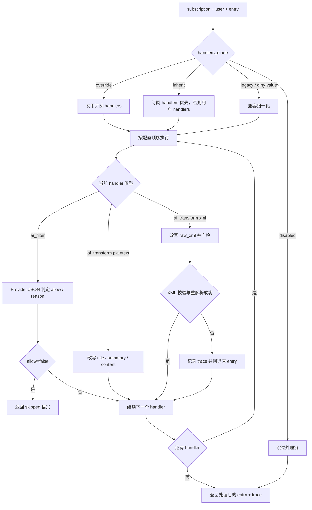

# Handler 运行时

## 负责什么

`ContentHandlerRuntime` 是订阅内容处理链的统一执行器。

它当前负责：

- 决定当前订阅到底启用哪组 handlers
- 按顺序执行 builtin handlers
- 收集 trace
- 处理 AI 失败放行

## 为什么单独做 runtime

handler 的本质是“可配置、可排序、可审计的内容处理步骤”。如果把它们散落在 polling、formatter、sender 里，会出现：

- 顺序不可见
- 配置无法挂在订阅/用户上
- AI 失败语义不统一
- 无法记录 trace

所以 runtime 层的价值，是把“处理链”本身变成一等对象。

## 执行流程图

Handler runtime 的关键不是“有哪些 handler”，而是配置如何解析、执行如何串联、失败如何回到主链路。

## handler 解析算法

核心输入：

- subscription
- user
- entry

解析顺序：

1. `handlers_mode=disabled` -> 不执行
2. `handlers_mode=override` -> 只使用订阅 handlers（可为空）
3. `handlers_mode=inherit`（默认）-> 订阅自带 handlers 优先，未配置时回落到用户 handlers。这样每个群/订阅配了自己的过滤与改写条件后立即生效，无需额外切 override。
4. 其他旧值/空值 -> 按 inherit 兼容处理

这里的目标不是做最严格的 schema 拒绝，而是在 runtime 里尽量容忍历史数据。

另外，`normalize_handlers` 在 handler 缺 `id` 时会用 `name` 自动生成 id（如 `builtin.ai_filter`），避免粘贴 JSON 时被静默丢弃；前端 `normalizeHandlers` 与之保持一致。

## 执行顺序

handlers 按配置顺序串行执行，上一个结果作为下一个输入。

这很重要，因为：

- 基础清洗已经先在 parser / formatter 链完成
- `ai_filter` 要基于当前条目内容决定是否放行
- `ai_transform` 要拿到前面已经处理过的结果

顺序不是按类型固定写死，而是按配置顺序执行。

## builtin handlers 当前语义

### `ai_filter`

- 输入范围支持：
  - `text`
  - `raw_xml`
  - `both`
- 输出：`allow` + `reason`
- 当 `allow=false` 时，dispatcher 写 `skipped` history，不发送
- 运行方式：直接调用当前 AstrBot chat provider，要求返回 JSON
- 失败语义：provider 为空、超时、脏 JSON、schema 不合法时默认放行

### `ai_transform`

- 统一通过 AstrBot `tool_loop_agent` 执行，而不是直接 `text_chat`
- 配置项：
  - `prompt`
  - `scope=plaintext|xml`
- `scope=plaintext`
  - 输入 `title/summary/content/link/author/feed_title/feed_link/media_urls`
  - 只允许输出 JSON 中的 `title/summary/content`
- `scope=xml`
  - 输入整段 `raw_xml` 与必要元信息
  - JSON Feed 条目的 `raw_xml` 是插件合成的 RSS `<item>` 片段，不代表上游原始 XML
  - agent 可调用内部 XML 校验工具反复自检，最多 6 步
  - 最终必须返回 `{"raw_xml":"..."}` 形式 JSON
  - 插件会对改写结果再次做 XML 安全校验与重解析，再重建正文、标题、链接和媒体
- 失败只记录 trace，不阻断主链路；会回退到原始 entry 继续发送

## XML scope 的设计理由

如果只允许 AI 改写清洗后的 plaintext，很多 RSS 源里的结构化信息会提前丢失：

- 多图顺序
- XML 内嵌的作者/来源节点
- HTML 片段里的媒体引用
- item/entry 级别的元信息

所以 `scope=xml` 直接把整段 item/entry 交给 agent 改写，但仍然通过三层门禁保证稳定性：

1. agent system prompt 明确 RSS item/entry 规范
2. 内部校验工具只负责报错，不替 agent 定稿
3. 插件侧最终再次校验和重解析，失败就回退原始内容

## 为什么 AI 默认失败放行

RSS 推送是持续型基础设施。AI provider 失败、超时、返回脏 JSON 都是高概率事件。

如果 AI 失败默认阻断，会导致：

- 正常 RSS 断流
- 用户很难判断是源没更新还是模型坏了
- 大量推送 history 卡在失败态

所以这里明确采用”AI 是增强层，不是门闸”的策略。只有 `ai_filter` 在成功返回 `allow=false` 时才主动阻断。

瞬时限流（”请求过于频繁”）、网络抖动、超时等**瞬时** provider 错误不会直接进入 fail-open：`provider.text_chat` 调用会做指数退避重试（默认最多 3 次，退避 1.5s / 3s），恢复后正常判定与改写；连续失败才记录 `error` trace 并照旧放行。`scope=xml` 的改写走 `tool_loop_agent`，自带工具循环与超时，重复调用可能重复执行工具副作用，因此不套退避。

## trace 的价值

每个 handler 不单独创建一条 push history，而是把摘要记录进当前 history 的 `handler_trace`。

这样做的好处：

- 一条推送只保留一条主审计记录
- 能看到具体在哪一步被过滤、报错或跳过
- 不会让 history 因处理链膨胀成多条碎片记录

当前 trace 至少会记录这些维度：

- `status`
- `scope`
- `allow`
- `reason`
- `steps_used`
- `fallback`
- `fallback_reason`
